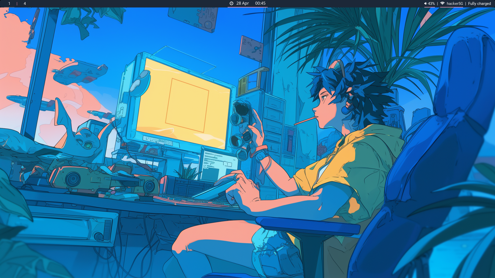
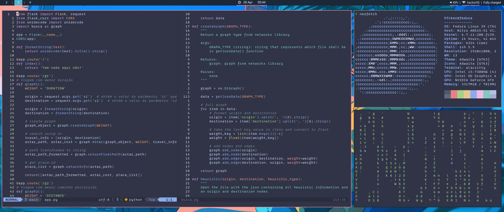
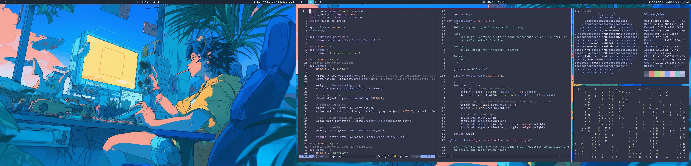
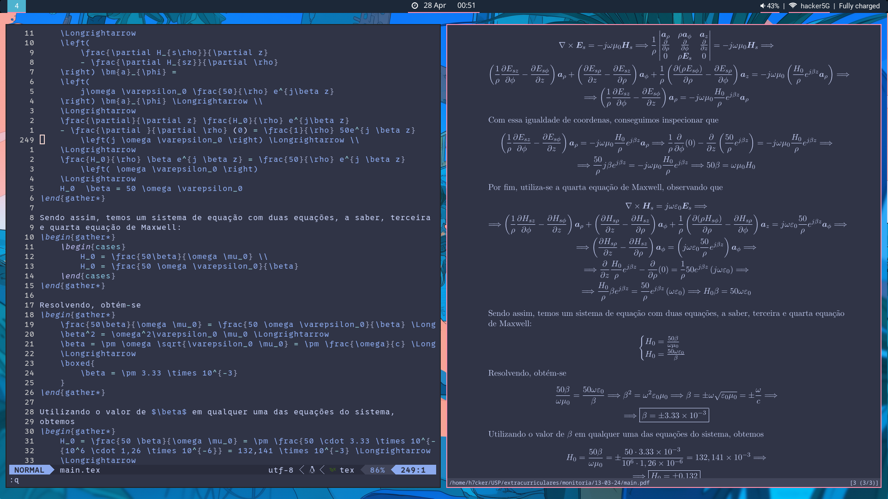

# dotfiles
my personal dotfiles currently running in Fedora 39.

## Dependecies
- stow
- all the other apps

Install all at once running this command:
```
sudo dnf install git polybar i3 rofi zathura zsh alacritty nvim stow -y
```

## How to use it 
To use a dotfile from an specific program just run on the root dir:
```bash
stow <program-dir>
```

### Nvim 
For nvim configuration you have to do  
```
git clone --depth 1 https://github.com/wbthomason/packer.nvim     ~/.local/share/nvim/site/pack/packer/start/packer.nvim
```

After that go to `packer.lua` and do a `:so` following by `:PackerSync`.

### Fonts

#### 0XProto
```
wget https://github.com/ryanoasis/nerd-fonts/releases/latest/download/0xProto.zip
```

Unzip
```
unzip -d 0xProto 0xProto.zip
```

Finally, add the fonts 
```
fc-cache -fv
```

If `fc-cache -fv` does not work, try moving the fonts manually by running the following command:
```
mkdir -p ~/.local/share/fonts
mv 0xProto/*.ttf ~/.local/share/fonts/
```

#### Roboto  
```
sudo dnf install google-roboto-fonts -y
```

#### Fontawesome 
```
sudo dnf install fontawesome-fonts -y 
```


## Demonstration




